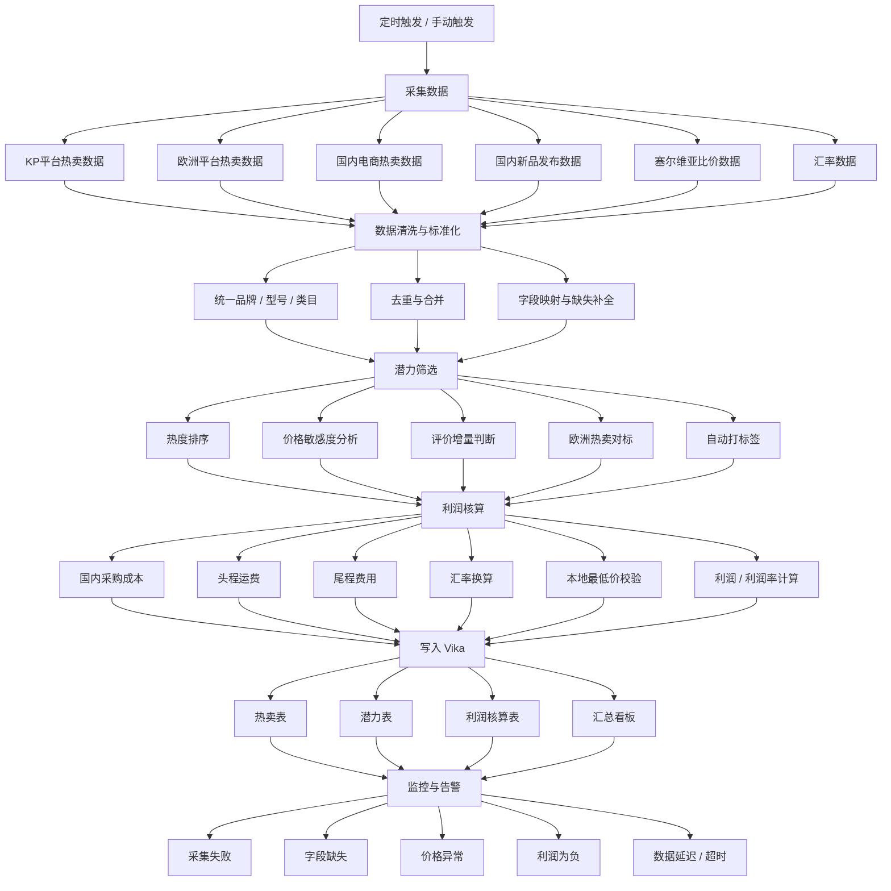
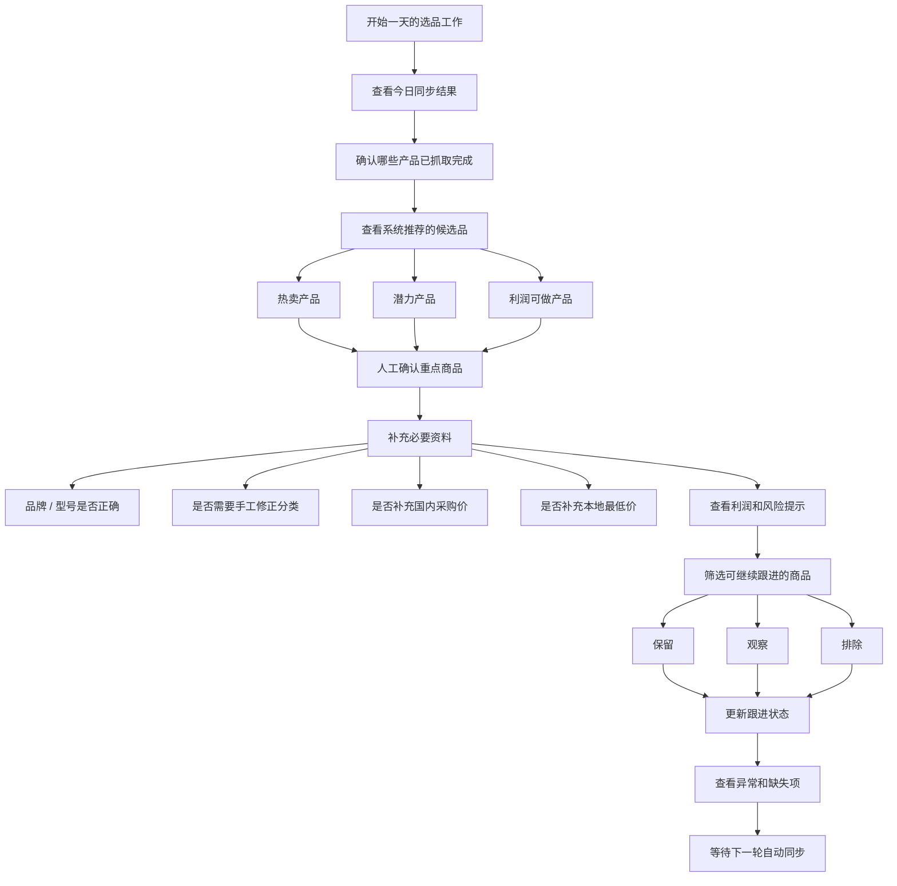

# 基础流程图

## 技术流程图

### 技术流程说明

- 适合直接拆成 `n8n` 模块或子流程
- `数据清洗与标准化` 建议独立成层，不要和采集逻辑混写
- `潜力筛选` 与 `利润核算` 分开，便于后续单独调规则
- `Vika` 建议按多表回写，后续再视情况汇总成一个主看板
- `监控与告警` 既处理流程失败，也处理业务异常

## 用户流程图

### 用户流程说明

- 用户版只保留业务操作，不展示接口、字段和公式
- 主线是：`看结果 -> 确认 -> 补资料 -> 看利润 -> 做决策`
- 首期状态建议只保留 `保留 / 观察 / 排除` 三档
- 需要让用户快速知道哪些商品存在信息缺失或需要人工补录
- 适合给业务负责人、运营人员、项目使用者查看

